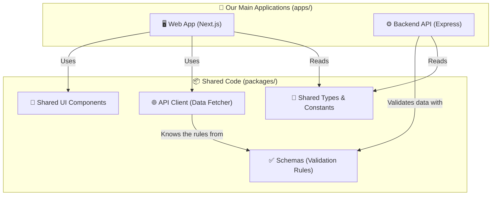

# 🤝 Team Onboarding & Development Rules

Welcome to the team! We are building a massive project in a very short amount of time for the Smart India Hackathon. To make sure we don't trip over each other, we have set up some strict rules and a clean folder structure.

Don't worry if this looks complex at first! This guide explains everything in simple, everyday language. 

---

## 🏗️ How the Project is Built (The "Monorepo")

We are using a **Monorepo**. Think of a monorepo as a giant master folder that holds all our sub-projects together. 

Instead of having one repository for the Frontend and a totally separate repository for the Backend, they both live here. 

### Why did we do this?
Imagine the Backend team creates a rule: *"A User must have an email and a password."* 
Normally, the Frontend team has to manually copy that exact rule into their code. If the Backend changes it later, the Frontend breaks!

In our Monorepo, we write that rule **ONCE** in the `packages` folder, and both the Frontend and Backend share it instantly. Magic! ✨

### 🗺️ The Architecture Map



---

## 📁 The Folder Structure Explained in Detail

### 1. `apps/` (The actual programs we are running)
This folder contains the programs that actually turn on and do things.

- **`apps/web/`**: This is our Frontend. It's built with Next.js and React. If you are building buttons, 3D models, charts, or pages the user sees, you work here.
- **`apps/api/`**: This is our Backend. It's built with Express and connects to the Database. If you are saving data, checking passwords, or writing server logic, you work here.

### 2. `packages/` (The Lego blocks we share)
This folder contains code that doesn't run on its own. Instead, it gets imported and used by `apps/web` and `apps/api`.

- **`packages/schemas/`**: This is where we write our data rules using a library called Zod. E.g., "A password must be 8 characters." Both the frontend login form and the backend database check these exact same rules.
- **`packages/ui/`**: This holds our generic UI components like `<Button>`, `<Card>`, or `<Input>`. If you make a cool button here, anyone on the frontend can use it!
- **`packages/api-client/`**: This is a smart helper tool. The frontend uses this to easily talk to the backend without having to write long `fetch()` requests manually.
- **`packages/shared/`**: Just a place to put constants or Typescript definitions that everyone needs.

---

## 📜 The Golden Rules

To ensure we win this hackathon and our code doesn't become a tangled mess, everyone must follow these rules:

### Rule #1: Never Duplicate Logic! 🚫
If you are writing something on the Frontend that the Backend also needs to know about (like the list of Research Station Names, or what data a Telemetry Sensor sends), **DO NOT write it twice.**
👉 **Put it in `packages/shared/` or `packages/schemas/` so both sides can use it.**

### Rule #2: Frontend Talks to API, NOT Database 🚫
The `apps/web` Frontend should **never** try to talk directly to the PostgreSQL database. 
👉 **The flow is always: Browser ➡️ Next.js ➡️ Express API ➡️ PostgreSQL.**

### Rule #3: Respect the Domain Structure 🧩
In our Backend (`apps/api/src/modules/`), code is separated into "Domains" (like `users/`, `telemetry/`, `alerts/`).
Keep things separated! Don't put "Telemetry" logic inside the "Users" folder. Keep the code organized in its proper box.

### Rule #4: Fix Errors Before Committing 🛑
Before you push your code to GitHub, always check if you broke anything:
Run this command in the root folder:
```bash
pnpm typecheck && pnpm lint
```
If you see red text, fix it! Broken code slows the whole team down.

### Rule #5: Use the `cn` UI Utility 🎨
When building components in `apps/web`, don't write messy CSS strings. We use `Tailwind CSS`. Use the `cn()` utility if you need to merge class names dynamically.

---

## 🛠️ Typical Workflow for a New Feature

Let's say we need a new feature: **"Add a Temperature Sensor"**

1. **Step 1 (Schemas):** Go to `packages/schemas` and write the rule: *A Temperature Sensor needs an ID and a Celsius value.*
2. **Step 2 (Backend):** Go to `apps/api/src/modules/telemetry/`. Write the code to save the temperature to the database. It uses the schema from Step 1 to make sure the data is valid.
3. **Step 3 (Client):** Go to `packages/api-client` and add a helper function `createTemperatureSensor()`.
4. **Step 4 (Frontend):** Go to `apps/web` and build the UI. Use the API Client to send the data.

Because of this setup, if you accidentally try to send a temperature as a word instead of a number, Typescript will yell at you before you even run the code!

**Good luck, comrades! Let's build something amazing!** 🧊🚀
